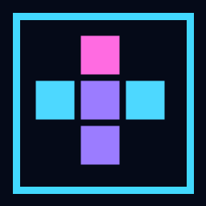

# Neon Tetris

A desktop and browser Tetris game with six modes, reactive 3D worlds, synthesized audio, progression, and unlockable visual customization. The 3D presentation has a Canvas fallback when WebGL is unavailable.

For code ownership and dependency boundaries, see [the architecture map](docs/architecture.md).



## Play on Windows

Download the portable Windows x64 executable from the [latest GitHub release](https://github.com/SeksiabiSimmu/neon-tetris/releases/latest) and run it. It does not need an installer. Progress and settings are saved for the current Windows user. An unsigned build may show a Windows reputation prompt.

## Run from source

Install Node.js 22.12 or newer and pnpm, then run:

```sh
pnpm install
pnpm dev
```

Open the local URL printed by Vite. To create a production browser build, run `pnpm build`. To run that build in Electron, run `pnpm desktop`. On Windows, `pnpm build:win` creates the portable executable in `release/`.

The same scripts work with npm (`npm install`, `npm run dev`, `npm run build`).

## Customization

Choose a block theme, falling effect, and background independently from **Customization**. The live inspector combines temporary selections and can demonstrate falling, soft drop, hard drop, landing, and line clear. Locked items can be previewed; only earned items can be equipped. The full list of items and exact unlock requirements is in the [customization catalog](docs/customization-catalog.md).

## Controls

| Action | Default keys |
| --- | --- |
| Move | Left / Right |
| Soft drop | Down |
| Hard drop | Space |
| Rotate clockwise | Up / X |
| Rotate counterclockwise | Z / Ctrl |
| Hold | C / Shift |
| Pause or return from a menu | Esc |
| Restart | R |

Keys can be rebound in Settings. The game also offers colorblind-friendly colors, reduced motion, and adjustable glow and particle intensity. Settings has a separate progression reset; mode records and key bindings remain saved.

## Modes

- **Endless** climbs from the surface toward space as levels increase.
- **Sprint** races to a chosen line target.
- **Marathon** caps the gravity speed at a chosen level.
- **Time Attack** scores against a countdown.
- **Zen** clears the board on top-out so play can continue.
- **Challenge** offers fixed objectives.

## Quality checks

`pnpm test` runs gameplay, progression, settings, rendering, and entry-point checks. `pnpm build` verifies the browser bundle.
